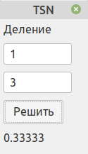
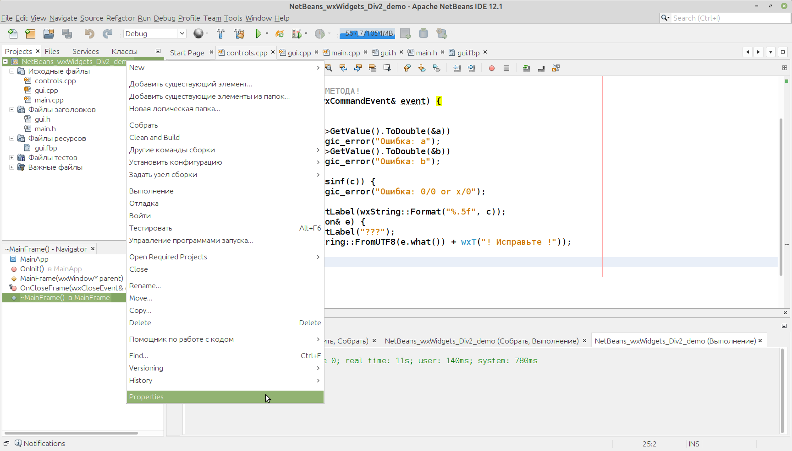
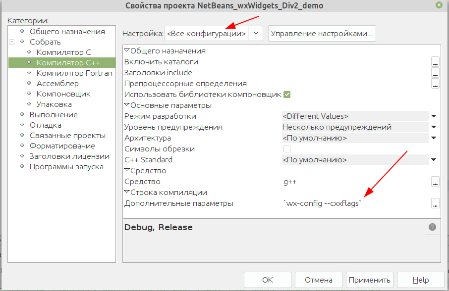
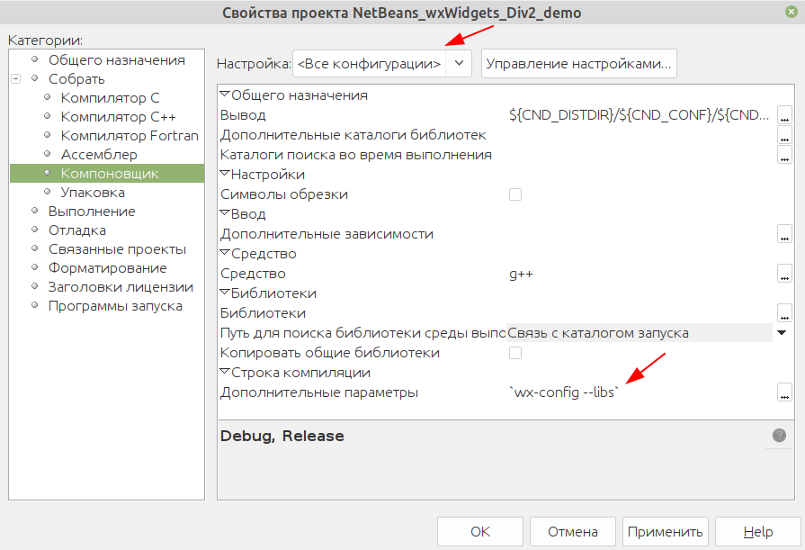

# NetBeans_wxWidgets_Div2_demo
Пример визуальной программы с wxWidgets на C++ в NetBeans
с использованием wxFormBuilder для Linux









```
// ЭТО РЕАЛИЗАЦИЯ НАШЕГО МЕТОДА ОБРАБОТЧИКА СОБЫТИЯ НАЖАТИЯ НА КНОПКУ!
void MainFrame::myClick(wxCommandEvent& event) {
    try {
        double a, b, c;
        if (!m_textCtrl1->GetValue().ToDouble(&a))
            throw std::logic_error("Ошибка: a");
        if (!m_textCtrl2->GetValue().ToDouble(&b))
            throw std::logic_error("Ошибка: b");
        c = a / b;
        if (isnan(c) || isinf(c)) {
            throw std::logic_error("Ошибка: 0/0 or x/0");
        }
        m_staticText2->SetLabel(wxString::Format("%.5f", c));
    } catch (std::exception& e) {
        m_staticText2->SetLabel("???");
        wxMessageBox(wxString::FromUTF8(e.what()) + wxT("! Исправьте !"));
    }
}
```

```
`wx-config --cxxflags`
`wx-config --libs`
```
